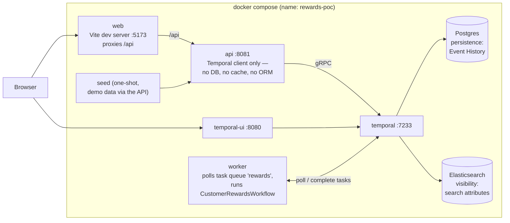
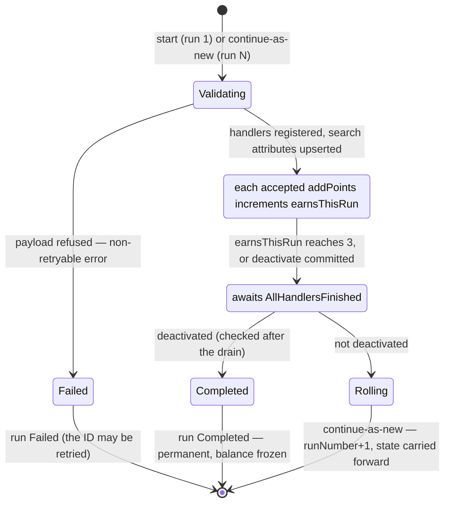
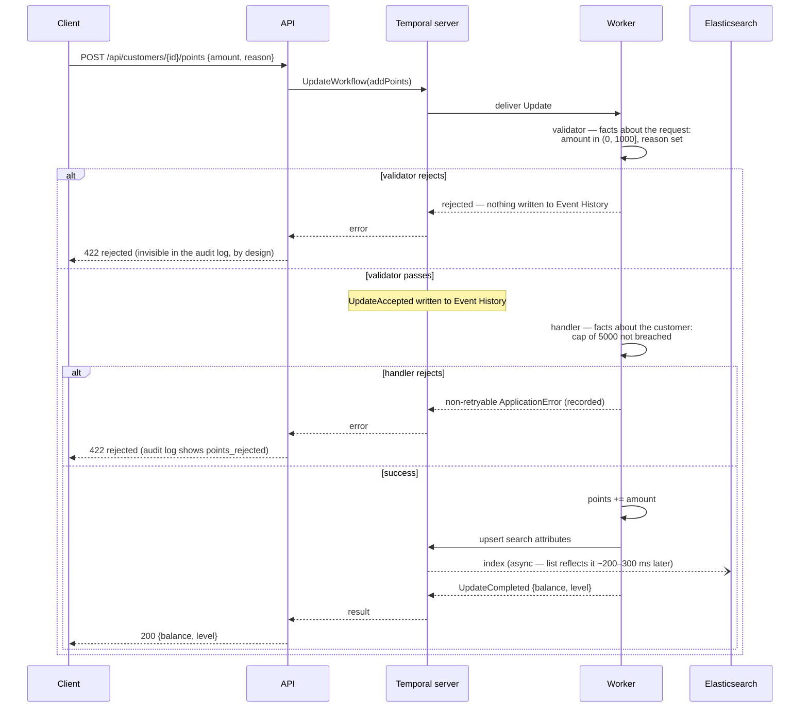
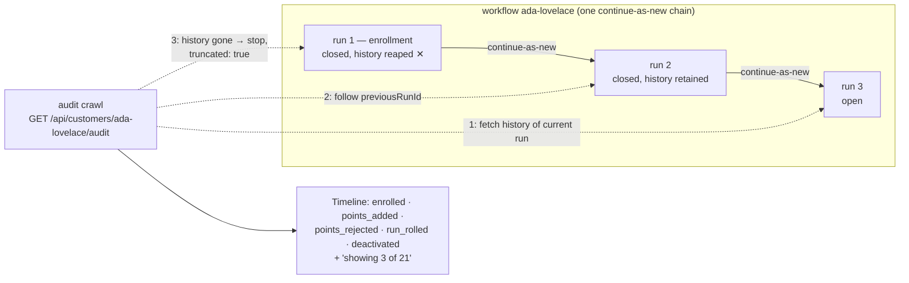

# Architecture diagrams

Companion to the [README](../README.md): the same design, drawn. Each section
names the code it depicts.

## The stack

Everything runs in [docker-compose.yml](../deploy/docker-compose.yml). The
central claim of the POC is visible in the shape: the API's only backend is
Temporal — Postgres and Elasticsearch sit *behind* Temporal (persistence and
visibility respectively), not behind the application.

The API's responses carry deep links into the Temporal UI, which is why the
browser talks to both.

## Workflow lifecycle

[`CustomerRewardsWorkflow`](../internal/rewards/workflows/workflow.go) — one
long-lived Entity Workflow per customer, in which each *run* is one link of a
continue-as-new chain. Two details worth reading off the picture: enrollment
validation failing *fails the run* (which is what lets
`ALLOW_DUPLICATE_FAILED_ONLY` allow a retry), and the deactivated flag is
checked *after* the handler drain, so a deactivate landing while a due roll
waits for handlers still completes the workflow instead of rolling into a run
nothing can ever wake.

Three earns per run is [`EarnsPerRun`](../internal/rewards/state.go), a demo
number; production would await `GetContinueAsNewSuggested()`.

## The addPoints Update

The round-trip behind `POST /api/customers/{id}/points`, showing the
validator/handler split: both rejections look identical to the caller (a 422
with code `rejected`), but only the handler's leaves a trace in Event History.
Also visible: why the customer *list* lags a write by ~200–300 ms (the search
attribute upsert is indexed asynchronously) while the detail page, which is a
Query, never does.

## The run chain and the audit crawl

Nothing stores a customer's point-add history. `GET /api/customers/{id}/audit`
([internal/audit](../internal/audit/)) fetches the current run's history and
walks *backwards* through the chain via each run's previous-run pointer,
reconstructing the timeline from events Temporal recorded anyway. Closed runs
are reaped after retention (1 h here, Temporal's minimum), so the walk can
stop short of the enrollment run — reported as truncation, quantified against
the `lifetimeEarnEvents` counter carried in workflow state, which survives
reaping because state rolls forward even though history does not.

